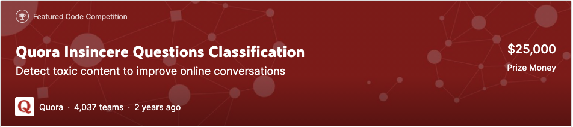
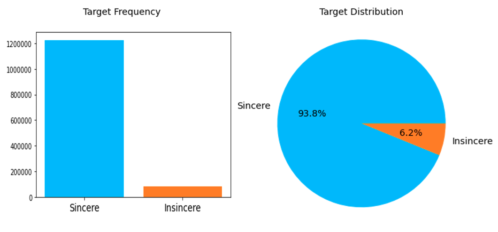

# Quora Insincere Questions Classification

This repository contains the code and two reports ([Data Exploration](https://github.com/markvasin/Kaggle-Quora-Insincere-Questions-Classification/blob/master/Data_Exploration_Report.pdf) and [Text Classification](https://github.com/markvasin/Kaggle-Quora-Insincere-Questions-Classification/blob/master/Machine_Learning_Report.pdf)) from participating in a Kaggle competition called Quora Insincere Questions Classification. This was part of a group coursework from COMP6208 Advanced Machine Learning class. We performed comprehensive exploratory data analysis and visualisation to obtain insights from data, and developed several machine learning models, ranging from logistic regression and SVM, to advanced models, such as LSTM with attention mechanism and BERT.

## Problem Statement

[Quora](https://www.quora.com/) is a platform that offers a convenient way for people across the world to ask questions on any topics and receive answers from others. However, among the questions and comments, some contents are malicious and not genuine for discussion, such as topics about gender, faith, and violence. These questions are called insincere questions and need to be recognized and prohibited. To alleviate this issue, Quora has created a competition on [Kaggle](https://www.kaggle.com/c/quora-insincere-questions-classification/) with the aim to encourage participants to create machine learning models to identify and flag insincere questions.

## Libraries
- Pandas
- scikit-learn
- PyTorch
- NLTK
- Matplotlib
## Exploratory Data Analysis
Samples of visualisations from performing EDA.

## Machine Learning Models
- Logistic Regression with bag of words and TF-IDF
- SVM with Naive Bayes features
- XGBoost
- TextCNN
- Bidirectional LSTM with Attention Mechanism
- Finetuning BERT